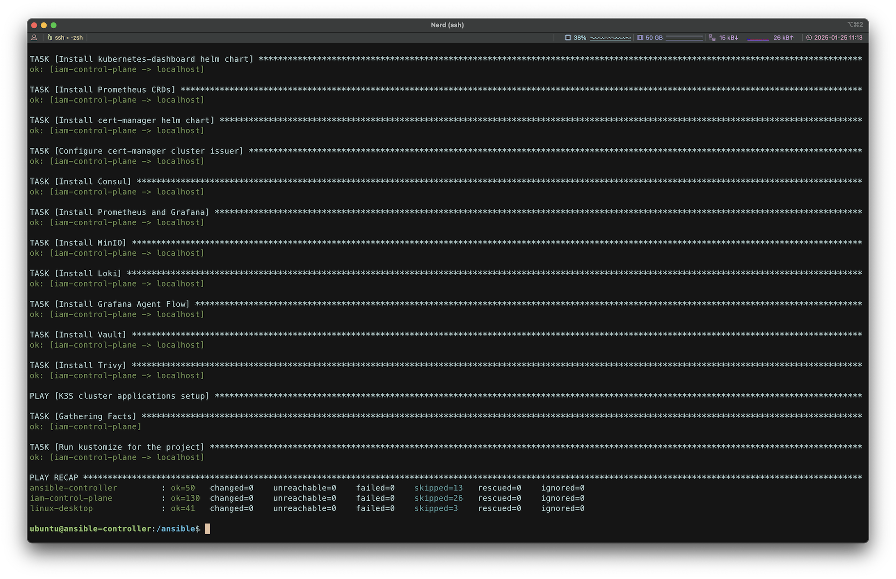
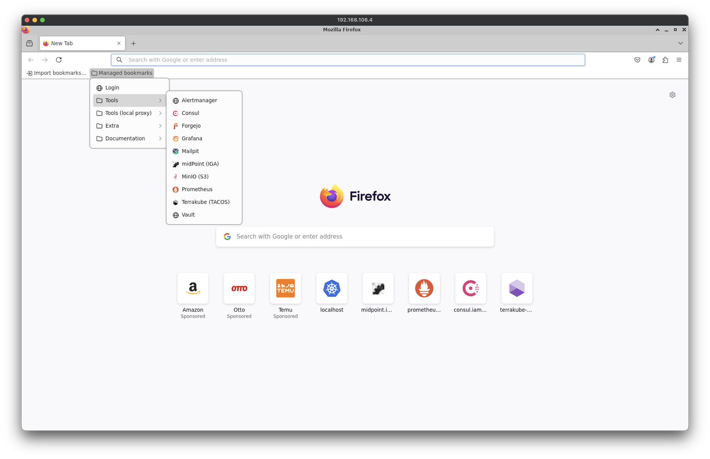
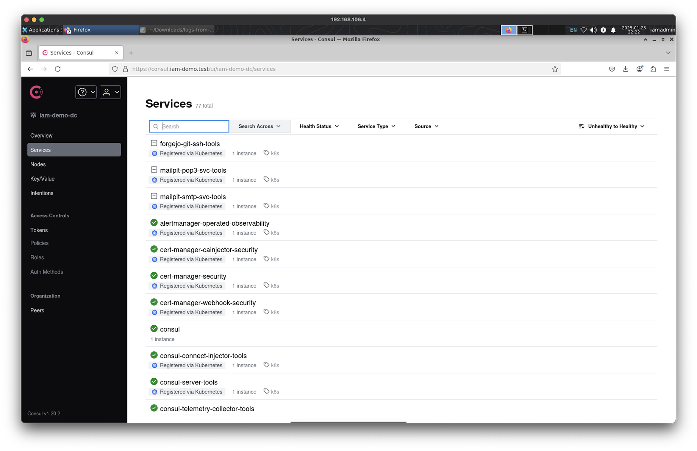
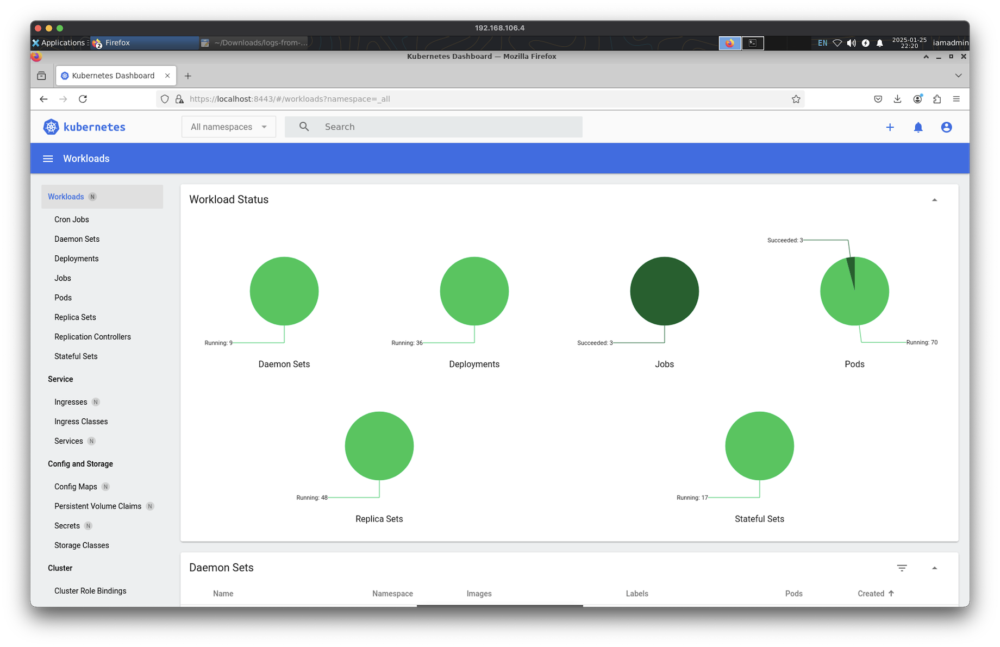
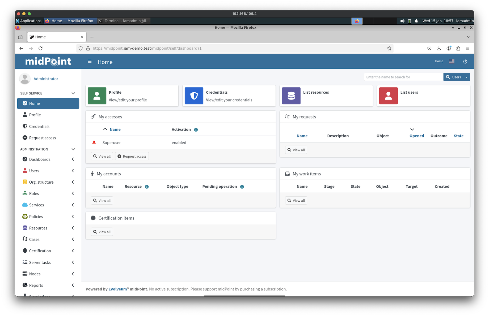
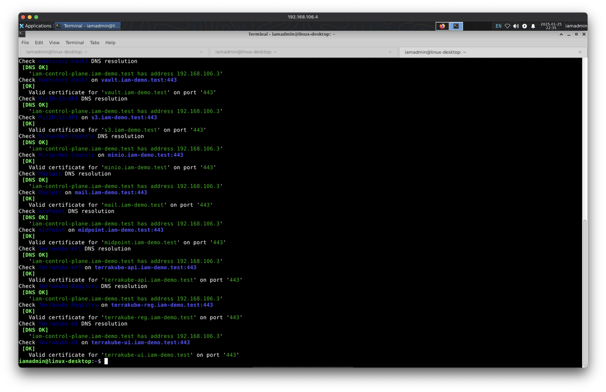
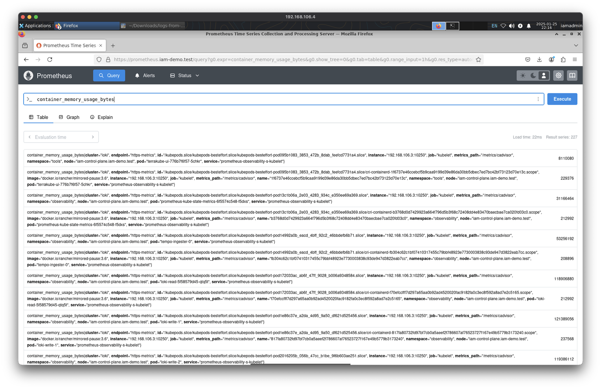
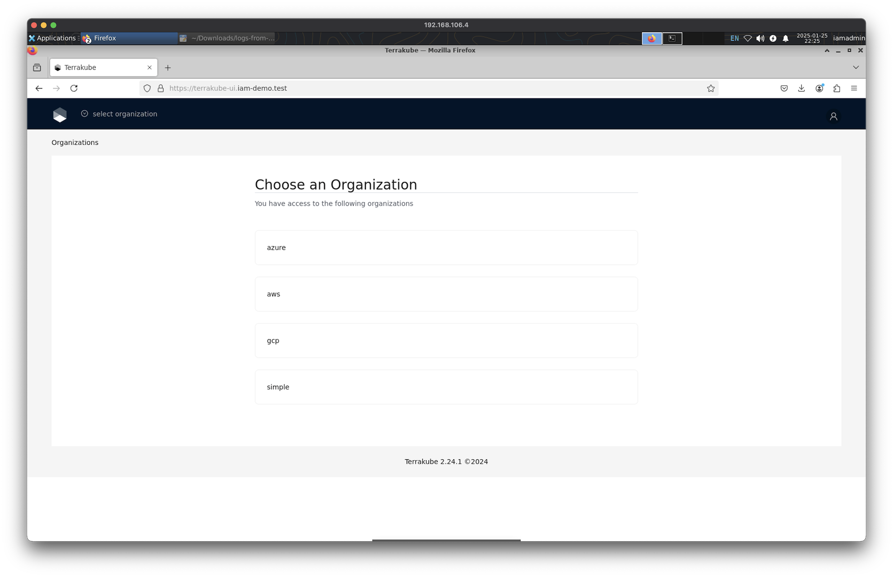
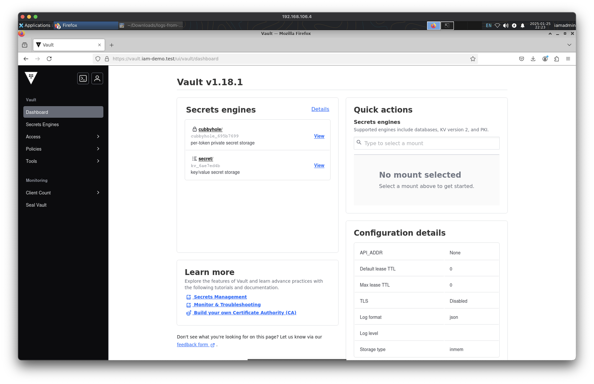

# Screenshots

[Project README](../README.md)

## Ansible controller

## Linux Desktop

### Firefox Managed Bookmarks

### Consul

### kubernetes-dashboard

### midPoint

### OpenSSL Checks

### Prometheus

### Terrakube

### Vault

